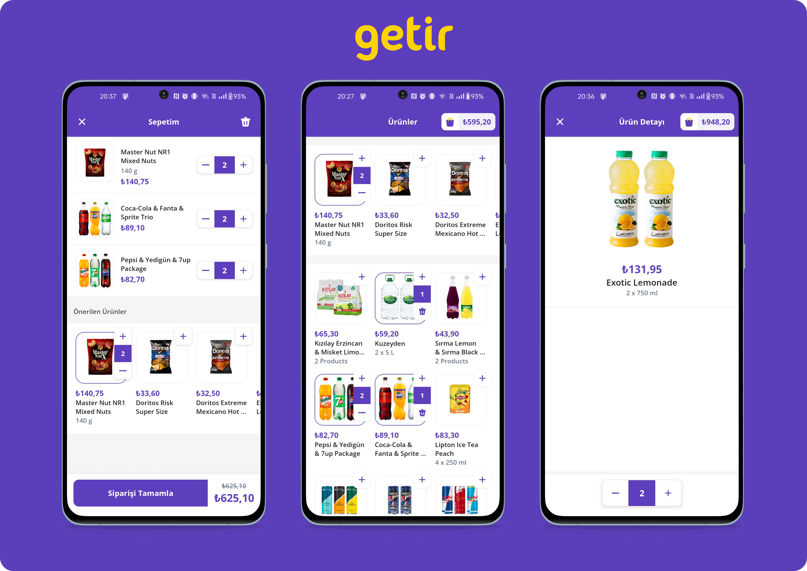
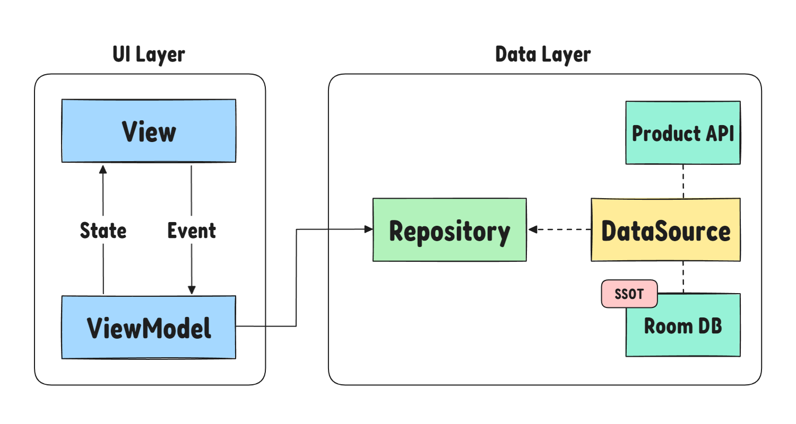

# Welcome to Getir Lite 👋

Getir Lite was developed with Kotlin and Android Views system, which consists of three separate screens. While developing the application, modern android development tools was utilized.



#### For other images, check out [here](public/screenshots/).

## Documentation & Download
You can check the documentation from [here](https://f-arslan.github.io/getir-bootcamp-final-project/).

Go to the [Releases](https://github.com/f-arslan/getir-bootcamp-final-project/releases) to download the APK.

## Tech Stack

- **Kotlin**: A modern, concise, and safe programming language fully interoperable with Java, ideal for Android development.

- **Android View System**: Utilizes custom views, animations, RecyclerView and Concat Adapter to create rich, dynamic, and responsive app interfaces.

- **Navigation and Safe Args**: Manages app navigation and safely passes data between destinations using Gradle plugin-generated classes.

- **Hilt & Dagger2**: Provides a robust dependency injection framework to simplify the architecture and boost scalability.

- **Coroutines & Flows**: Handles asynchronous tasks smoothly and efficiently, enhancing UI responsiveness with simplified code for complex tasks.

- **Retrofit2 & Kotlinx Serialization**: Powers network operations and JSON data serialization, ensuring reliable data fetching and processing.

- **Room**: Offers an abstraction layer over SQLite to allow for robust database access while harnessing the full power of SQLite.

- **Coil**: An image loading library designed specifically for Kotlin, making image loading on Android simple and efficient.

- **JUnit4 and Coroutine Testing**: Facilitates robust unit testing to ensure that code changes do not break the application.

- **Gradle and Version Catalog**: Streamlines dependency management by centralizing and versioning library dependencies, ensuring consistent builds and simplifying the upgrade process across an Android project.

- **[Dokka](https://github.com/Kotlin/dokka)**: Generates documentation from Kotlin source code, useful for maintaining clear and up-to-date documentation.

Each component in this stack contributes to a robust, maintainable, and efficient Android application, ensuring top performance and user experience.

## Demo


https://github.com/f-arslan/getir-bootcamp-final-project/assets/66749900/8ffaa9bd-7ed7-4234-8e85-bc53ed76d9a7


## Technical Details

While developing the application, modern Android development methodologies were used, such as MVVM, modular approach, SOLID principals, Coroutines & Flows (observer pattern and concurrency), dependency injection, repository pattern, custom views, navigation with safe arguments, and _clean code_. The ultimate goal is to increase readability and reduce boilerplate and code repetition. Let's start with the UI section.

#### UI Layer

When developing the user interface, [this](https://www.figma.com/file/ij9uGvRjMHWmUq0q7m90mj/Bootcamp-Screens?type=design&node-id=0-1&mode=design) Figma design followed. In the application, there is one main activity and three fragments, respectively. And the navigation between them is provided by `androidx.navigation`. With the help of a navigation system, we pass the data as a safe argument (product ID) from the listing to the detail screen. And nice transitions are used between fragments.

Custom views and animations like animated border and basket button movements are used while developing the user interface. An example of a custom view can be the stepper component, which is fully customizable, like button and text container sizes, orientation, and more.

As a glue between the data layer and UI components, view models and shared view models were used. For the UI states, `Flow` and `StateFlow` were utilized. With the help of this data, which was nicely streamlined to the UI, and the help of the view models, the data survived configuration changes. While showing items to the user, `Recyclerview` and `ConcatAdapter` were used.

For more information, you can check the [documentation](https://f-arslan.github.io/getir-bootcamp-final-project/).


<div align="center">

</div>


#### Data Layer

In the data layer, there are remote and local modules. The UI layer does not directly communicate with the local or remote data sources for better separate of concerns. Instead, it uses `Product Repository` also in the data layer, as a proxy for this. Every data source (a class that includes business logic and implementation details) has a repository to represent public APIs accessible from other modules. With the help of this, we are not exposing unnecessary information and also increasing the security of the data sources. Also, when we need to test the data source, we inherit from the interface and create fake data sources for this, which you can find in the Android and unit test folders.

Let's talk about some internal details, starting with the data flow when the application is launched. It fetches the data from the API and saves it to the local database. However, it's not that quick. Consider a scenario with no internet connection: The system verifies whether the required data is available locally before attempting a network fetch.

Okay, let's recheck the flow. When the application opens, it checks the local database with a Status table. It is a simple entity with two fields representing whether the data (products and suggested products) is loaded locally. If both fields indicate true, then the application proceeds to open. If one of them or both is missing, it gets the necessary data from the remote help of the `Retrofit` and `kotlinx-serialization.` But what happens if the remote is down or there is no internet connection?
To address connectivity issues, an exponential retry mechanism alerts the user about the status, with retry intervals increasing exponentially up to a maximum of 30 seconds.
```kt
val products: StateFlow<BaseResponse<List<ProductWithCount>>> = productRepository
    .getProductsAsFlow()
    .transform {
        val state = productRepository.getStatus().firstOrNull()
        when {
            state == null -> emit(BaseResponse.Loading)
            !state.isProductLoaded -> throw ProductNotLoadedException()
            state.isProductLoaded -> emit(BaseResponse.Success(it))
            else -> emit(BaseResponse.Loading)
        }
    }
    .retryWhen { cause, attempt ->
        if (cause is ProductNotLoadedException && attempt < MAX_RETRIES) {
            val delayTime = calculateDelay(attempt)
            if (attempt >= 3) emit(BaseResponse.Error(NoConnectionException(delayTime)))
            productRepository.fetchDataFromRemoteAndSync()
            delay(delayTime)
            true
        } else {
            false
        }
    }
    .catch { error ->
        if (error !is ProductNotLoadedException) {
            emit(BaseResponse.Error(GenericException(error.message)))
        }
    }
    .stateIn(
        scope = viewModelScope,
        started = SharingStarted.WhileSubscribed(5000),
        initialValue = BaseResponse.Loading
    )
// delay function
val calculateDelay: (Long) -> Long = { attempt: Long ->
    min(MAX_DELAY_MS, RETRY_DELAY_MS * (2.0.pow(attempt.toDouble())).toLong())
}
```
And the data was observed from respective fragments only between `STARTED` and `ONPAUSE`. From the event perspective (user events like clicking and typing), events go to the view model and then to the repository; after the repository handles the event, fragments can be collected. With the help of unidirectional data flow, code became easier to reason about.

As a wrap-up, the application implements a Single Source of Truth (SSOT) strategy. With the help of this, you can manage the data in one place, and it is also better for testability. You can find further details in official [documentation](https://developer.android.com/topic/architecture#single-source-of-truth).
